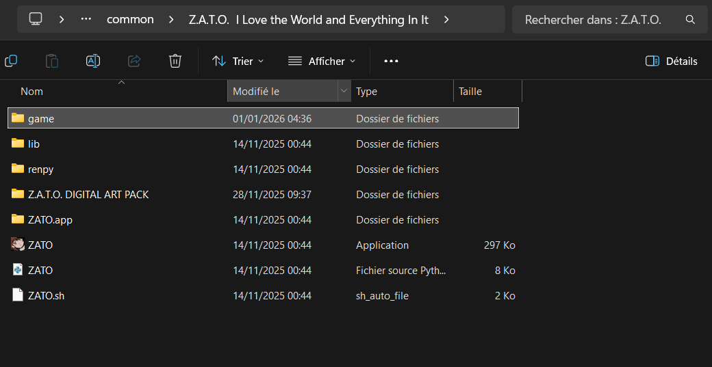

# Z.A.T.O. – Traduction française

Projet de traduction française de **Z.A.T.O. // I Love the World and Everything In It**.

### How to use it?
Download the two files, go to the game's local files and place them in the "game" folder.
Now you're good to go, enjoy!

### Comment ça marche ?
Téléchargez les deux fichiers, allez les dans les fichiers locaux du jeux et placez les dans le dossier "game".
Et c'est parti vous pouvez jouer !

## Exemples

Avant / Before :

Après / After :

## Progression
- [x] Ecran titre
- [x] Menus
- [x] Prologue
- [ ] Episode 1
- [ ] Episode 2
- [ ] Episode 3
